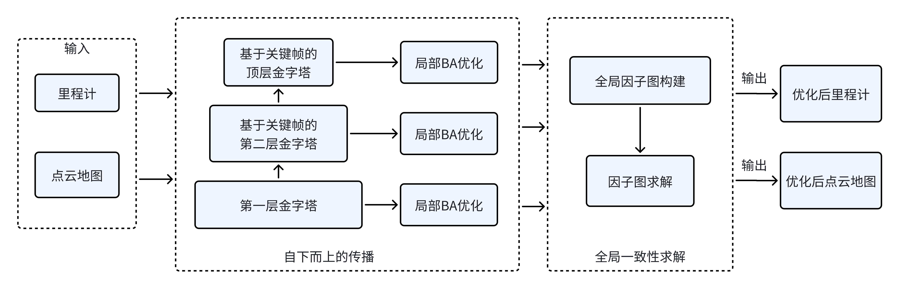
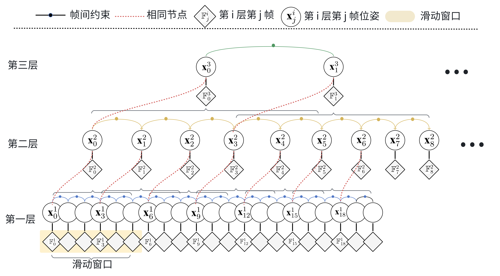
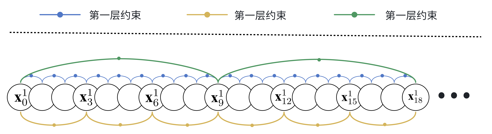

# PointCloudmap_BA

### 1.0 Framework

<div align="center"></div>
<div align="center"></div>
<div align="center"></div>


## **3. Run the Code**
```
source hba_ws/devel/setup.bash
roslaunch hba hba.launch
```